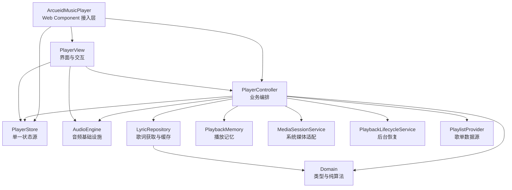

# Arcueid Music Player 架构与重构说明

本文说明 `arcueid-music-player` 当前的项目架构、它是如何从 `xf-music-player` 的实验实现中拆分出来的，以及相较旧实现和参考项目分别删减、保留、增强了哪些内容。

## 1. 重构目标

旧版 `xf-music-player` 已经实现了音频播放、歌单切换、播放模式、Canvas 波形和同步歌词，但大量职责集中在 `player-element.ts`：

- 默认歌曲与完整歌词直接写在组件类中；
- 音频事件、状态更新、切歌规则和 UI 事件互相调用；
- DOM 创建、内联样式、Canvas 交互和业务编排混在同一个生命周期方法中；
- 新增云端歌单、播放记忆或主题时，只能继续扩大自定义元素类；
- UI 很难独立调整，核心播放行为也难以替换或测试。

本次重构没有引入大型框架，而是保留原生 Web Components 与 HTML5 Audio，通过分层解决耦合问题：

> 自定义元素负责接入，Controller 负责编排，Store 保存状态，AudioEngine 操作音频，Service 处理外部能力，UI 只渲染和转发用户意图。

## 2. 当前目录结构

```text
arcueid-music-player/
├── public/
│   ├── audio/                     # 本地演示音频
│   └── lrc/                       # 与音频对应的 LRC 歌词
├── src/
│   ├── core/
│   │   ├── audio-analysis-source.ts # 向多个波形组件分发共享分析帧
│   │   ├── audio-engine.ts        # HTMLAudioElement、AudioContext 和音频事件
│   │   ├── player-controller.ts   # 播放器用例与模块编排
│   │   └── player-store.ts        # 单一状态源与订阅机制
│   ├── data/
│   │   └── demo-playlist.ts       # 演示歌单，不再写进组件类
│   ├── domain/
│   │   ├── types.ts               # Song、PlayerState、LyricLine 等领域类型
│   │   ├── playlist.ts            # 纯歌单索引算法
│   │   └── playlist.test.ts       # 歌单算法测试
│   ├── services/
│   │   ├── lyric-parser.ts        # LRC/网易云元信息解析与二分定位
│   │   ├── lyric-parser.test.ts   # 歌词解析测试
│   │   ├── lyric-repository.ts    # 歌词获取、缓存和请求取消
│   │   ├── media-session.ts       # 系统媒体键、锁屏元数据和位置同步
│   │   ├── playback-lifecycle.ts  # 后台持久化与回到前台后的播放恢复
│   │   ├── playlist-provider.ts   # 本地数组、JSON API 与文件歌单适配
│   │   └── playback-memory.ts     # localStorage 播放记忆
│   ├── ui/
│   │   ├── components/
│   │   │   ├── icon.ts            # Lucide 图标适配入口
│   │   │   ├── lyric-view.ts      # 歌词列表渲染、滚动和点击跳转
│   │   │   ├── now-playing-rail.ts # 当前歌词与迷你波形底边栏
│   │   │   └── waveform.ts        # 响应式 Canvas 波形/进度条
│   │   ├── player-view.ts         # 界面结构、状态映射和事件转发
│   │   └── player.css             # 完整组件样式和响应式规则
│   ├── index.ts                   # 注册自定义元素并导出公共类型
│   ├── create-player.ts           # 程序化挂载、多实例与生命周期钩子
│   └── player-element.ts          # Web Component 接入层与公共 API
├── docs/
│   ├── ARCHITECTURE.md            # 本文
│   ├── BROWSER-COMPATIBILITY.md   # 浏览器能力边界和真实设备验证矩阵
│   ├── FINAL-BROWSER-AUDIT.md     # 最终交互流程与截图证据
│   ├── MIGRATION.md               # 从旧组件迁移到稳定公共 API
│   ├── STAGE-2-3-BROWSER-AUDIT.md # 阶段 2/3 浏览器流程审核
│   └── ROADMAP.md                 # 后续功能计划
├── examples/
│   └── minimal.html               # 程序化挂载最小示例
├── browser-audit.html             # 可复现的浏览器验收夹具
├── design-qa.md                   # 视觉与浏览器验证记录
├── index.html                     # 本地演示入口
├── package.json
├── tsconfig.json
└── vite.config.ts
```

## 3. 分层关系

依赖方向是单向的，上层可以调用下层，下层不反向感知上层界面。



这里最重要的约束是：

1. `PlayerView` 不直接改变 Store，也不直接调用 `<audio>`；它把“用户点击下一首”转成 `controller.next()`。
2. `AudioEngine` 不知道歌单、歌词、当前面板或 DOM；它只负责音频加载和播控。
3. `PlayerController` 不创建 DOM；它只把音频事件、歌单规则、歌词服务和状态更新串起来。
4. `PlayerStore` 是 UI 状态的唯一来源，组件不再分别维护多个互相冲突的布尔变量。
5. `domain/` 不依赖浏览器 API，纯逻辑可以直接运行单元测试。

## 4. 各模块的具体职责

### 4.1 `player-element.ts`：接入层

`ArcueidMusicPlayer` 是网页使用者看到的自定义元素。它只负责：

- 读取 `play-mode`、`volume`、`remember-playback` 等 HTML 属性；
- 初始化 Shadow DOM、Store、Engine、Controller 和 View；
- 管理连接/断开时的资源创建与释放；
- 提供 `play()`、`pause()`、`next()`、`seek()` 等公共方法；
- 派发 `ready`、`trackchange`、`playbackchange` 和 `error` 稳定事件；
- 将外部赋值的 `playlist` 交给 Controller；
- 提供空格、方向键等宿主级键盘快捷键。

它不再保存内联歌词、不再逐个创建按钮，也不再处理歌词滚动或 Canvas 绘制。

### 4.2 `PlayerController`：业务编排层

Controller 是播放器的用例中心，负责回答“某个用户动作应该引发哪些模块变化”。主要用例包括：

- 初始化当前歌曲与恢复播放记忆；
- 播放、暂停、上一首、下一首和指定歌曲播放；
- 顺序、单曲、随机模式切换；
- 单曲结束后的续播规则；
- 切歌时加载新歌词、取消旧请求并忽略过期结果；
- 根据当前时间计算活动歌词；
- 更新音量、静音、进度与 UI 面板状态；
- 延迟写入播放记忆，并在进入后台时立即落盘；
- 编排歌单 Provider 导入、队列追加、删除和排序。
- 对音频失败自动重试一次，并跳过持续失败的歌曲。

所有“跨模块行为”集中在这里，因此后续排查播放状态问题时不需要从 DOM 事件一路追到多个文件。

### 4.3 `AudioEngine`：音频基础设施

AudioEngine 封装浏览器音频 API：

- 创建并持有唯一的 `HTMLAudioElement`；
- 统一处理 `timeupdate`、`waiting`、`playing`、`ended`、`error` 等媒体事件；
- 暴露播放、暂停、停止、跳转、音量和静音方法；
- 在用户播放时延迟创建 `AudioContext`，避免浏览器自动播放限制；
- 通过 `GainNode` 控制应用内音量，兼容 Safari/iOS Safari；
- 提供 Analyser 时域数据和缓冲进度给共享分析源；
- 通过 `seekWhenReady()` 安全恢复记忆进度；
- 销毁时关闭音频上下文并释放订阅。

Engine 发布 `AudioSnapshot`，但不直接更新 UI，Controller 决定如何把快照写入 Store。

### 4.4 `PlayerStore`：状态层

Store 保存完整 `PlayerState`：

- 歌单和当前索引；
- 当前时间、总时长、缓冲位置、音量和静音；
- 播放、加载和错误状态；
- 播放模式；
- 当前打开的歌词/歌单面板；
- 歌词列表与活动歌词索引。
- 歌词时间偏移、错误恢复动作与歌单导入反馈。

它是一个很小的发布订阅实现，没有引入 Zustand。这样既保留“单一状态源”，又避免当前体量下不必要的运行时依赖。

### 4.5 `domain/`：领域类型与纯规则

`types.ts` 定义跨模块共享的数据契约。`playlist.ts` 只处理索引：

- 越界索引归一化；
- 顺序模式首尾循环；
- 随机模式确保下一首不等于当前歌曲；
- 空歌单统一返回 `-1`。

这些函数不访问 DOM、Audio 或 Store，因此最容易被可靠测试和复用。

### 4.6 `services/`：可替换的外部能力

歌词被拆成两个部分：

- `lyric-parser.ts` 只负责把字符串解析成 `LyricLine[]`，并通过二分查找定位当前歌词；
- `lyric-repository.ts` 决定歌词来自内联数组、内联 LRC 还是 URL，同时负责缓存与 AbortController 请求取消。

`playback-memory.ts` 单独封装 localStorage。存储不可用或内容损坏时只降级，不影响基础播放。

`media-session.ts` 单独封装浏览器 Media Session API。Controller 只提供播放、暂停、切歌和跳转用例，Service 负责系统媒体键、锁屏元数据、播放状态与位置同步；不支持该 API 的浏览器自动降级为空实现。

`playback-lifecycle.ts` 记录用户的播放意图，页面隐藏时触发即时持久化，恢复可见或从 BFCache 返回时重新激活音频。显式暂停会清除播放意图，因此不会出现“回到页面后擅自播放”。

`playlist-provider.ts` 定义统一的 `PlaylistProvider` 接口，并提供数组、JSON API 和用户文件三种实现。Provider 只负责读取和规范化数据，Controller 决定替换还是追加队列，View 不直接发起网络请求。

`create-player.ts` 是可选的程序化入口。每个实例都创建独立 Element、Store、Engine 和默认播放记忆 key；Media Session 跟随最近开始播放的实例。

### 4.7 `ui/`：表现层

`PlayerView` 只做三件事：

1. 创建一次稳定的播放器 DOM；
2. 订阅 Store，将状态映射到标题、按钮、时间、面板等元素；
3. 将点击、拖动等用户输入转发给 Controller。

歌词和波形继续拆成小组件：

- `LyricView` 管理歌词行 DOM、活动行高亮、居中滚动和点击跳转；
- `WaveformRenderer` 管理 DPR、ResizeObserver、requestAnimationFrame 和真实频域数据；没有分析数据时降级为普通进度线。

所有样式移动到 `player.css`，不再在 TypeScript 中逐条写 `element.style`。

## 5. 播放数据流

以“点击下一首”为例：

```text
用户点击下一首
  → PlayerView 捕获事件
  → PlayerController.next()
  → domain/playlist.ts 计算目标索引
  → Store 更新 currentIndex
  → AudioEngine.load(song)
  → LyricRepository 获取对应歌词
  → AudioEngine.play()
  → AudioEngine 持续发布播放快照
  → Controller 写入 Store
  → PlayerView 根据 Store 更新界面
```

歌词更新流程：

```text
Audio timeupdate
  → AudioSnapshot.currentTime
  → Controller 调用 findActiveLyric()
  → Store.activeLyricIndex 更新
  → LyricView 切换高亮并滚动到当前行
```

这个流程避免了旧版的“AudioEngine 回调直接操作歌词 DOM、Store 订阅直接播放音频、组件又同时持有局部状态”的交叉依赖。

## 6. 从 `xf-music-player` 到新项目的拆分映射

| 旧位置 | 旧职责 | 新位置 | 拆分结果 |
| --- | --- | --- | --- |
| `src/config/type.ts` | 歌曲、模式、歌词类型 | `src/domain/types.ts` | 类型统一，并补充完整播放状态与面板类型 |
| `src/core/store.ts` | 只保存歌单、索引、模式 | `src/core/player-store.ts` | 扩展为 UI 唯一状态源，保留轻量订阅模型 |
| `src/core/audio-engine.ts` | 音频控制、分析器、多个回调槽 | `src/core/audio-engine.ts` | 改为快照订阅，补充安全恢复进度和完整资源释放 |
| `src/core/playlist.ts` | 上一首、下一首、递归随机 | `src/domain/playlist.ts` | 变成可注入随机源的纯函数，空歌单使用 `-1` |
| `src/services/lyric-parser.ts` | LRC 解析和当前行定位 | `src/services/lyric-parser.ts` | 保留并收紧数据结构，继续使用二分定位 |
| `src/render/components/lyric-bar.ts` | 歌词 DOM 和滚动 | `src/ui/components/lyric-view.ts` | 与解析逻辑彻底分离，支持点击歌词跳转 |
| `src/render/components/waveform.ts` | 固定尺寸 Canvas 绘制 | `src/ui/components/waveform.ts` | 增加 DPR、响应式尺寸、生命周期和无数据降级 |
| `src/player-element.ts` | 默认数据、Store、音频、切歌、歌词、按钮、样式、Canvas | `player-element.ts` + Controller + View + Service + Data | 原来的巨型组件被拆为独立职责模块 |
| 组件内的完整歌词字符串 | 演示数据 | `public/lrc/` + `demo-playlist.ts` | 歌曲元数据和歌词文件分离，组件体积明显降低 |
| 组件中的 `console.log` | 调试分析器和播放时间 | 删除 | 正式代码不再产生调试噪音 |

## 7. 相较旧版 `xf-music-player` 的删减

以下内容不是功能倒退，而是删除重复实现或错误的职责位置：

- 删除 `player-element.ts` 中数百行内联歌词和默认歌单；
- 删除组件生命周期中手工创建每个按钮、Canvas 和歌词容器的过程；
- 删除 TypeScript 中的零散内联样式；
- 删除播放时间、分析器数据和模式切换的 `console.log`；
- 删除 UI 对 AudioEngine 内部分析器状态的直接检查；
- 删除多个只能保存一个回调的 `onPlay/onPause/onTimeUpdate` UI 耦合槽，改成订阅模型；
- 合并独立的“播放”和“暂停”按钮为有状态的主按钮；
- 默认不展开歌单，保持参考播放器的紧凑入口；
- 不把复杂歌单 JSON 塞进 HTML 字符串属性；使用 `playlist` 属性、`playlist-src` 或 `PlaylistProvider`。

## 8. 相较旧版 `xf-music-player` 的新增与增强

- 新增 `PlayerController`，明确播放器用例入口；
- 新增完整播放状态：时间、时长、音量、静音、加载、错误、歌词和面板；
- 新增 `LyricRepository`，支持歌词 URL、缓存、切歌请求取消和过期结果保护；
- 新增播放记忆，可恢复歌曲、进度、音量、静音和播放模式；
- 新增可展开的歌单和歌词面板；歌单支持搜索、增删、按钮/拖拽排序和当前歌曲自动定位；
- 新增点击歌曲切歌、点击歌词跳转和点击波形调整进度；
- 新增宿主键盘快捷键：空格播放/暂停、左右键快退/快进、上下键调整音量；
- 波形新增 DPR 适配、ResizeObserver 和真实音频数据不可用时的进度线降级；
- 新增移动端布局、焦点样式、ARIA 标签和减少动态效果适配；
- 新增公开实例 API 与状态快照读取；
- 新增数组、JSON API、用户文件三种 PlaylistProvider 与完整队列编辑；
- 新增 Media Session 系统媒体控制和后台恢复；
- 新增歌单算法与歌词解析测试；
- 新增桌面/移动端浏览器验证与 Design QA 记录。

## 9. 相较 GitHub 参考项目的取舍

参考仓库 `s33806/music-player` 的发布版本包含 Lit、Howler、Zustand、云端歌单、主题、国际化、插件、播放记忆和更完整的实例控制器。当前项目借鉴的是它的产品形态和能力边界，没有完整复制发布包。

### 当前保留或重新实现

- Web Component 接入方式；
- 底部固定、可展开的紧凑播放器形态；
- 本地歌单、歌词同步、波形进度、播放模式；
- 播放记忆；
- ESM/IIFE 构建和 TypeScript 类型导出；
- 可被外部 JavaScript 调用的实例方法。

### 当前主动删减

- Lit、Howler、Zustand 等运行时依赖；
- 云端 API 与自定义 `audioProvider`；
- 多套内置主题和自定义主题字符串注入；
- 中英文国际化；
- 性能监控面板；
- Sakura、旧浏览器跳转等页面级插件；
- 自定义标签名、自动挂载控制器和完整生命周期钩子；
- 自动播放、延迟加载动画和复杂云端错误提示；
- 专辑封面区域。当前本地 MP3 没有可用封面资源，因此没有用假图占位。

这些能力并非永远排除，而是为了先稳定播放内核，避免刚完成拆分又重新形成一个全能组件。

### 当前额外增加

- 更明确的 Controller/Service/UI 边界；
- 无框架也能理解的完整源码，而不是只依赖构建产物；
- 点击歌词跳转；
- 键盘快捷键和更明确的文字控制；
- 小屏响应式验证；
- 针对播放记忆恢复递归问题的安全处理；
- 架构、路线图和视觉 QA 文档。

## 10. 公共使用方式

HTML 属性适合简单配置：

```html
<arcueid-music-player
  play-mode="order"
  volume="0.8"
  remember-playback
  playlist-src="/api/playlist.json"
></arcueid-music-player>
```

复杂歌单使用 JavaScript 属性：

```ts
import type { Song } from 'arcueid-music-player'

const player = document.querySelector('arcueid-music-player')!

player.playlist = [
  {
    id: 'demo',
    title: 'Demo Song',
    artist: 'Artist',
    src: '/audio/demo.mp3',
    lyricsUrl: '/lrc/demo.lrc',
  },
] satisfies Song[]
```

当前公共方法：

```text
play()
pause()
stop()
toggle()
next()
previous()
select(index)
seek(seconds)
seekBy(seconds)
setVolume(volume)
mute()
setPlayMode(mode)
loadPlaylist(provider, mode?)
usePlaylist(songs, mode?)
addSongs(songs)
removeSong(index)
moveSong(from, to)
getState()
```

## 11. 后续功能应该放在哪里

为了继续保持边界清晰，建议按照下表扩展：

| 新功能 | 推荐位置 | 原因 |
| --- | --- | --- |
| 云端歌单/文件导入 | 已实现于 `services/playlist-provider.ts` | 网络和文件数据源不属于组件或 AudioEngine |
| Media Session | 已实现于 `services/media-session.ts`，由 Controller 驱动 | 隔离浏览器系统媒体 API |
| 后台恢复 | 已实现于 `services/playback-lifecycle.ts` | 页面生命周期不进入 Engine 或 View |
| 队列增删/排序/搜索 | 已实现于 `domain/playlist.ts` + Controller + View | 纯规则、业务编排和界面状态各自独立 |
| 深色/浅色主题 | `player.css` token + Element 属性适配 | 业务逻辑不感知颜色 |
| 专辑封面 | 扩展 `Song.cover`，由 View 渲染 | 数据契约和表现分开 |
| IndexedDB 缓存 | 替换或扩展 Service | 不改变 Controller 对外用例 |
| 播放事件 API | Element 监听 Store 并派发 CustomEvent | 外部消费者不直接订阅内部 Store |
| 逐字歌词 | 新 parser/model + 独立 lyric component | 不让现有行级歌词组件继续膨胀 |

## 12. 当前架构的边界与不足

当前结构已经适合小型可复用播放器，但还不是完整流媒体产品：

- Controller 仍直接依赖具体的 AudioEngine、Repository 和 Memory 类，后续可引入接口以方便 mock 测试；
- 目前只有纯逻辑单元测试，尚缺 Controller 状态机和真实浏览器自动化测试文件；
- Store 是全量快照订阅，歌单很大或更新非常频繁时可增加 selector；
- 公共事件 API 尚未稳定，外部集成目前主要依靠实例方法和 `getState()`；
- 音频跨域、网络错误重试和无效音频跳过仍在路线图中；
- 已接入 Lucide 图标库；演示歌单尚未提供专辑封面资源。

这些限制都可以在现有边界内逐步解决，不需要再次推翻组件结构。后续阶段计划见 [`ROADMAP.md`](./ROADMAP.md)。
