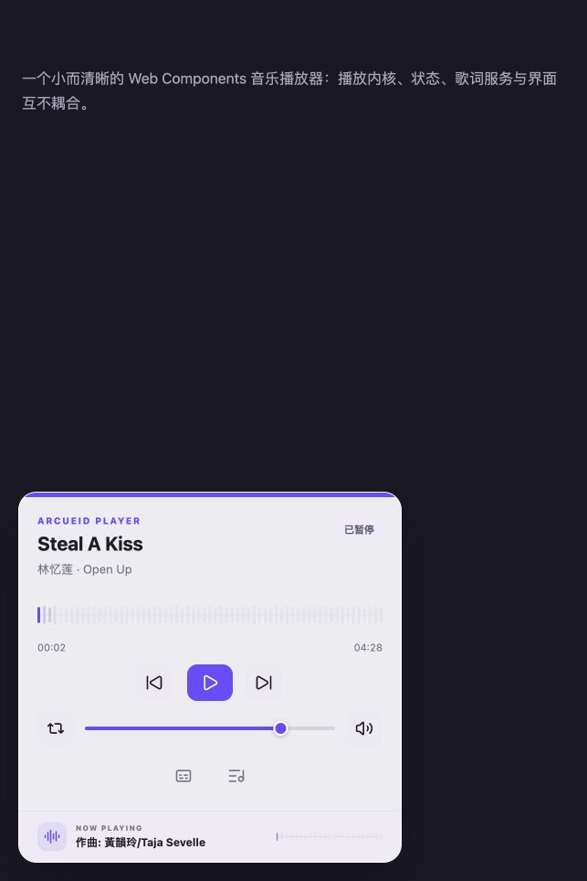
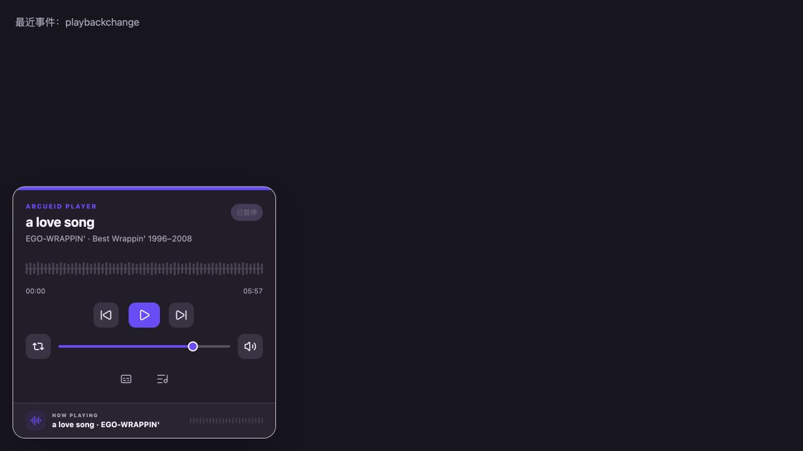
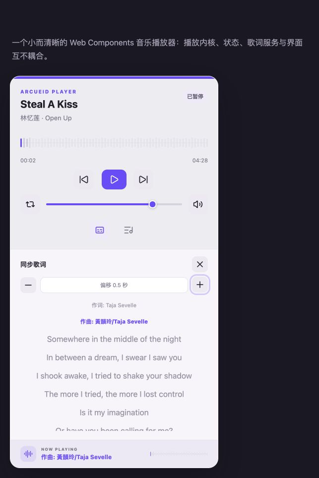
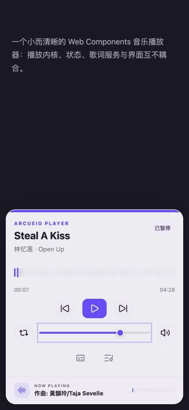
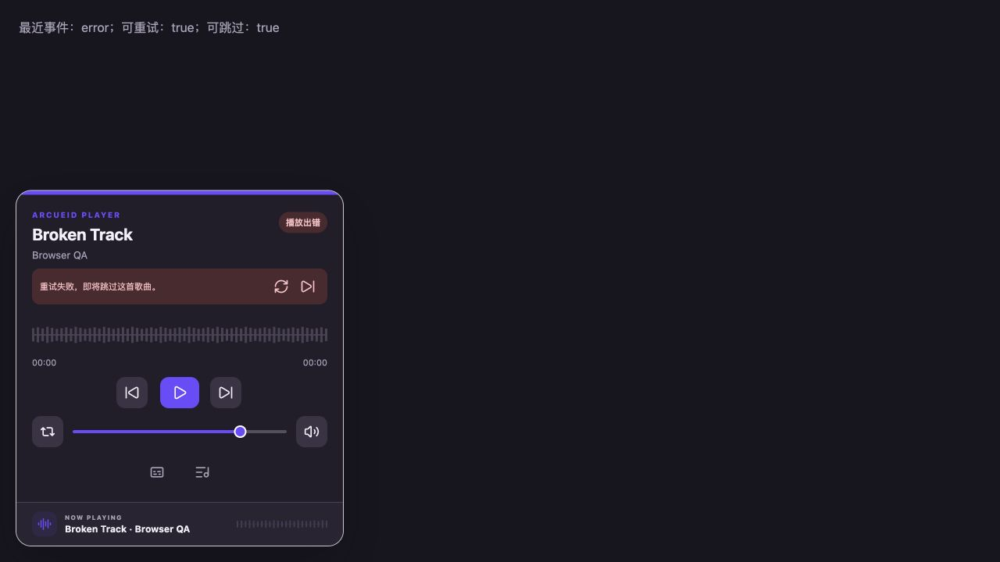
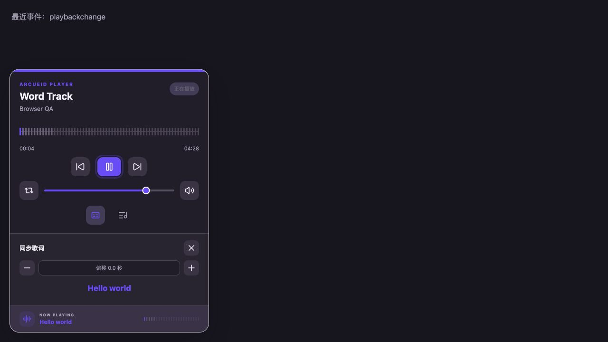

# 最终浏览器审核

审核日期：2026-08-26  
审核环境：Codex 内置 Chromium 浏览器、Vite 开发服务器  
覆盖范围：播放器主流程、主题、响应式布局、歌词校准与逐字高亮、故障恢复、公共事件和键盘操作。

## 结论

本轮未发现阻断发布的界面或交互问题。播放器在桌面和 390 × 844 移动视口下均保持完整布局；波形轨道与进度交互区等宽；图标按钮具备可访问名称；播放失败时能够重试、展示恢复动作并自动跳到下一首可播放歌曲。

## 流程审核

1. **初始加载与核心播放区：通过**
   - 标题、歌手、状态、播放时间、播放模式、音量和底边栏均正常渲染。
   - 波形/进度轨道占满卡片内容宽度，不再出现 Canvas 比交互进度条短的视觉断层。

   

2. **深色主题：通过**
   - `theme="dark"` 可正确解析为深色 token，播放器表面、按钮、文字、波形和底边栏对比关系一致。

   

3. **歌词面板与时间校准：通过**
   - 歌词面板可展开/收起，活动行可识别。
   - “提前 0.5 秒”“重置”“延后 0.5 秒”均为可聚焦按钮；点击后界面即时显示当前偏移。

   

4. **键盘操作：通过**
   - 播放进度滑块按 `ArrowRight` 从 00:02 移动到 00:07。
   - 音量滑块按 `ArrowDown` 从 0.80 调整到 0.75。
   - 浏览器语义树可识别播放进度、音量、播放控制和内容面板。

5. **移动端布局：通过**
   - 390 × 844 视口下卡片无横向溢出或裁切。
   - 进度、播放、音量、歌词和队列入口均保留；触屏环境中的队列操作按钮会常驻显示。

   

6. **播放失败恢复：通过**
   - 不存在的媒体资源先自动重试一次。
   - 二次失败后展示 `role="alert"`，提供“立即重试”和“跳过”图标按钮，并在短暂等待后自动前进到下一首可播放歌曲。
   - `error` 公共事件在故障状态出现时正常派发。

   

7. **逐字歌词与事件：通过**
   - 带 `words` 数据的歌词可进行逐字高亮，底边栏同步显示当前歌词。
   - 审核夹具确认 `ready`、`trackchange`、`playbackchange` 和 `error` 均能被宿主页监听。

   

8. **控制台：通过**
   - 正常播放与逐字歌词场景没有 JavaScript `error` 或 `warn` 日志。
   - 故障场景只使用刻意缺失的音频资源验证恢复流程，没有导致页面崩溃或未处理异常。

## 设计与可访问性评价

### 优点

- 播放器视觉层级清晰，主播放按钮、进度波形和当前歌词的优先级明确。
- 文字按钮已收敛为 Lucide 图标，所有图标按钮仍保留明确的 `aria-label`。
- 浅色、深色和系统主题共用语义 token，没有把主题逻辑渗透到播放内核。
- 错误状态使用独立色彩与 `role="alert"`，同时给出恢复动作，不会只显示技术错误。

### 风险与证据边界

- 内置浏览器不能替代 macOS Safari 与真实 iOS Safari；Web Audio `GainNode` 的应用内音量路径已通过代码和单元测试覆盖，但仍建议发布前在真实设备上执行一次手势播放、音量、锁屏和后台恢复矩阵。
- Media Session 的系统媒体键和锁屏卡片依赖操作系统集成，浏览器 DOM 审核只能验证播放器状态与事件；系统级行为由服务测试覆盖，最终证据仍需真实设备。
- 音频跨域服务器若未返回正确 CORS 响应，播放器会降级为原生音频输出并展示可恢复错误；部署时仍应为音频与歌词资源配置允许的来源。

## 后续维护准则

- 新播放规则继续进入 `core/`，外部平台能力进入 `services/`，视觉与手势保持在 `ui/`。
- 每次新增公共属性、方法或事件时，同步更新类型导出、README、迁移文档和至少一个测试。
- 每次发布前固定执行：单元测试、生产构建、`npm pack --dry-run`、桌面/移动浏览器主路径，以及真实 Safari/iOS 媒体能力抽查。
