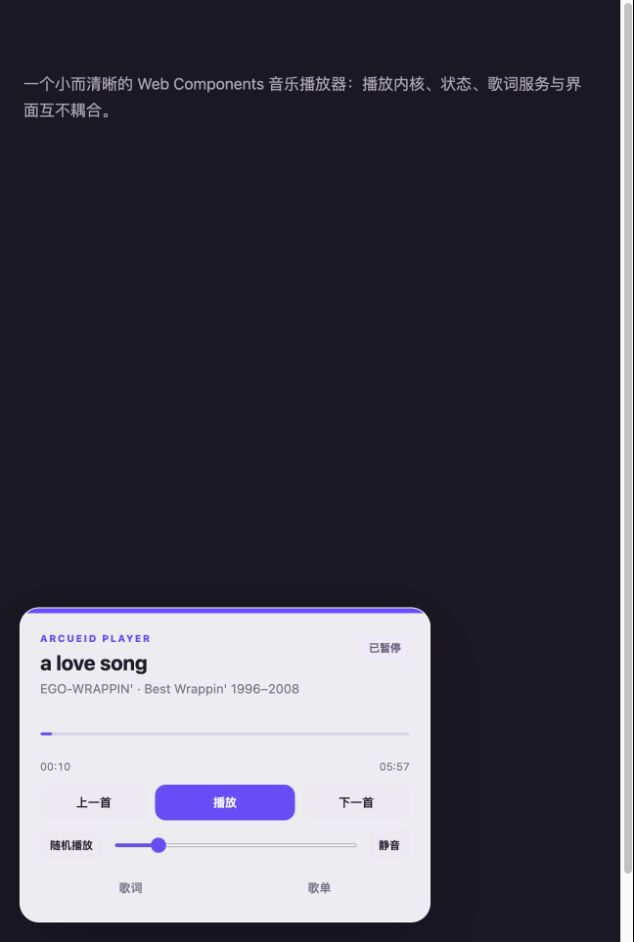
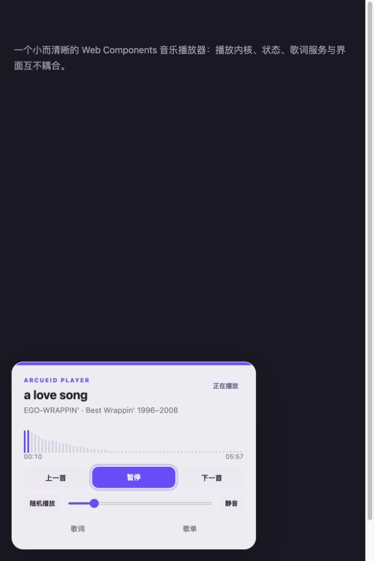
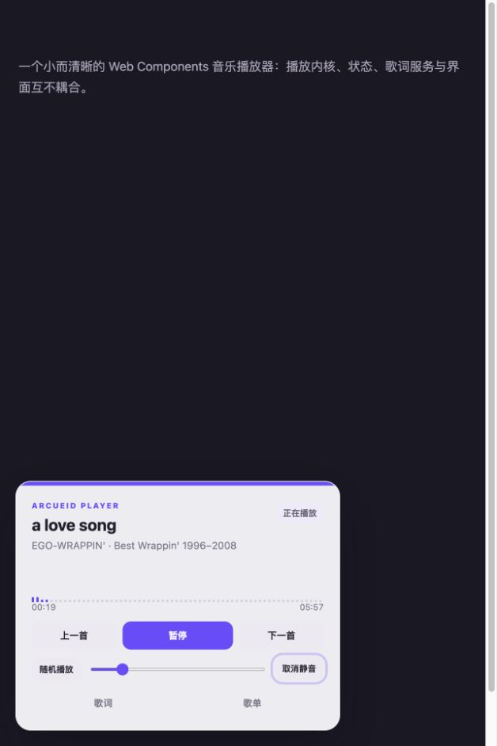
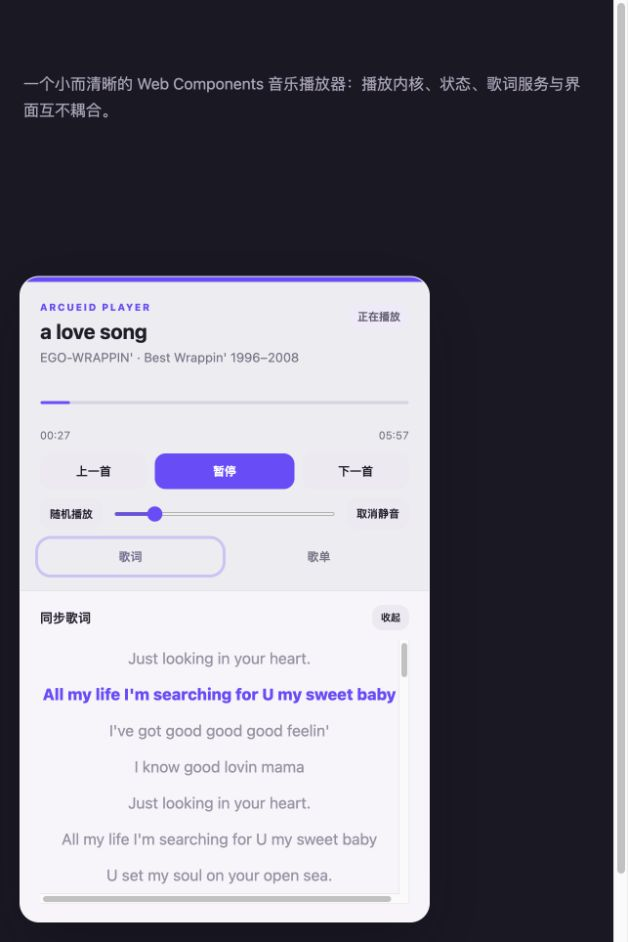

# 播放器交互与可视化优化规划

> 日期：2026-08-26  
> 范围：波形/进度、底边歌词、图标化控制、Safari 音量条，以及这些改动对应的架构边界。

## 结论

当前两个主要问题都不是单纯的样式瑕疵：

1. 现有 Canvas 横轴表达的是“当前时刻从低频到高频的频谱”，不是“歌曲从开头到结尾的波形”。高频能量通常较弱，因此右侧柱子接近最低高度，视觉上像波形没有铺满进度条。
2. 静音前后音量值没有变化；真正变化的是布局。按钮文字从“静音”变为“取消静音”后，右侧自动列变宽，音量条宽度从 248px 缩短到 226px。
3. 音量条只依赖原生 `input[type="range"]` 与 `accent-color`。这种写法简单，但 Safari 的外观与事件历史存在平台差异，需要显式覆盖 WebKit 轨道和滑块样式，并用真实 Safari 回归验证。

## 审查证据

### 1. 暂停时：波形退化成独立进度线



当分析器没有有效数据或播放器暂停时，`WaveformRenderer` 直接绘制一条进度线；波形与进度并不是一个持续一致的控件。

### 2. 播放时：频谱能量在右侧衰减



Canvas 实际宽度与可点击区域一致，但柱高随频率索引向右衰减，造成“波形比进度条短”的感受。

### 3. 静音时：文字增长挤压音量条



`utility-row` 使用 `auto 1fr auto`。右侧按钮增长 22px 后，中间的 range 恰好缩短 22px；range 的值仍然是 `0.16`。

### 4. 歌词目前只能在展开面板中看到



完整歌词面板已经可用，但它会显著增加卡片高度。更适合补充一个常驻、紧凑的“正在播放底边栏”，用于展示当前歌词和轻量动态波形；完整歌词面板继续承担浏览与点击跳转。

## 目标方案

### A. 将波形和进度统一成一个控件

第一阶段不制作“整首歌预计算波形”，而是改为稳定铺满宽度的实时可视化进度轨：

- `AudioEngine` 新增 `getTimeDomainData()`，使用时域采样而不是直接把频率 bin 当作横轴。
- `WaveformRenderer` 先绘制完整的未播放波形，再用播放进度做裁剪并绘制强调色区域。
- 给振幅设置可辨识的最小高度，保证暂停、轻音乐和高频较弱时仍能看见完整轨道。
- 鼠标悬停或拖动时叠加进度指示器，不再把波形替换成一条线。
- Canvas 只负责装饰图形；时间、进度语义和键盘操作仍由真实按钮/滑块提供。
- 同时保留 DPR、`ResizeObserver` 和点击定位，补上窄屏、缩放与高分屏测试。

如果未来确实需要“横轴代表整首歌曲时间、形状固定不跳动”的波形，再引入第二种 `PeakProvider`：在客户端解码整首音频或由服务端提供 peaks。它会增加跨域、内存、首次加载和缓存成本，不应作为本轮修复前置条件。

### B. 增加紧凑的正在播放底边栏

新增独立的 `NowPlayingRail`，不要把它继续塞进 `PlayerView`：

- 高度控制在 44–56px，显示当前歌词；没有歌词时回退为歌曲名/艺术家。
- 当前歌词保持真实 DOM 文本，迷你波形作为背景或下沿装饰，并标记为非语义内容。
- 点击底边栏打开现有完整歌词面板；完整面板继续支持歌词浏览和点击跳转。
- 主波形与底边栏共用一个分析帧来源，避免两个组件分别启动 `requestAnimationFrame` 和重复读取分析器。
- 提供关闭或精简配置，避免宿主页面不需要歌词时仍占据空间。

建议增加一个小型 `AudioAnalysisSource`：每帧只读取一次时域数据，发布 `{ samples, energy, progress }` 给主波形和底边栏。它属于音频/可视化适配层，不进入 store；store 继续只保存可序列化的播放器状态。

### C. 控制按钮图标化，并保持布局稳定

- 使用维护中的图标库（建议 Phosphor Icons），不要在模板中散落手写 SVG。
- 上一首、播放/暂停、下一首、静音/取消静音、播放模式、歌词和歌单改为图标。
- 控制按钮使用固定宽高（建议 36–40px），图标状态变化不再改变列宽。
- 可见文字可以移除，但保留中文 `aria-label`、`title`/tooltip 和 `aria-pressed`。
- 播放模式图标可以切换为顺序、单曲循环、随机；tooltip 明确当前模式及点击后的行为。
- 触控目标至少 40px，聚焦样式继续可见；不能只依赖颜色表达状态。

### D. Safari 音量条兼容

保留原生 range 的语义和键盘能力，不用普通 `div` 模拟滑块：

- 对 input 设置 `appearance: none` 和 `-webkit-appearance: none`，使用透明的可交互外壳扩大命中区域。
- 分别实现 `::-webkit-slider-runnable-track`、`::-webkit-slider-thumb`、`::-moz-range-track`、`::-moz-range-progress` 和 `::-moz-range-thumb`。
- 用 CSS 变量同步已播放百分比，使 Chrome、Firefox、Safari 的填充视觉一致。
- 继续监听 `input` 做实时更新，并增加 `change` 作为提交兜底；验证鼠标、触控、方向键、VoiceOver 调整。
- 静音只切换 `muted`，不覆盖用户原音量；恢复声音后应回到静音前的音量。
- 为音量提供 `aria-valuetext="16%"`，图标则根据 0、低、中、高、静音选择状态。

Safari 需要真实设备/浏览器矩阵验证：macOS Safari 当前版和前一主版本、iOS Safari 当前版，以及 Chrome/Firefox 桌面回归。现有应用内浏览器不能替代这一步。

## 实施顺序

| 阶段 | 预计工作量 | 内容 | 完成标准 |
| --- | ---: | --- | --- |
| P0 复现与基线 | 0.5 天 | 记录 Safari 版本、range 的 `input/change` 事件、鼠标/触控/键盘表现；加入关键尺寸测量 | 能稳定复现并记录 Safari 问题，已有 Chrome/Firefox 行为不回退 |
| P1 控件稳定 | 1–2 天 | 图标库、固定尺寸按钮、静音布局、跨浏览器 range 样式 | 状态切换无位移；三大桌面浏览器可拖动；键盘和读屏名称可用 |
| P2 波形进度一体化 | 2–3 天 | 时域采样、两次裁剪绘制、悬停/拖动指示、暂停降级 | 任何状态下轨道铺满；进度颜色与播放位置同步；点击/键盘跳转正常 |
| P3 歌词底边栏 | 1–2 天 | `NowPlayingRail`、当前歌词回退、点击展开、共享分析帧 | 不展开面板也能看到当前歌词；无歌词时不空白；没有重复动画循环 |
| P4 质量与扩展 | 1–2 天 | 视觉回归、低性能降帧、`prefers-reduced-motion`、移动端与 Safari 回归 | 窄屏、高分屏、缩放、后台恢复和减少动画设置均稳定 |

## 建议的模块边界

```text
core/
  audio-engine.ts          音频播放 + Analyser 原始数据
  audio-analysis-source.ts 每帧采样一次，向多个视觉组件分发

ui/components/
  waveform.ts              主波形进度轨，只负责绘制与命中换算
  now-playing-rail.ts       当前歌词 + 迷你波形底边栏
  icon.ts                   图标库的统一适配入口

ui/
  player-view.ts           组合组件与绑定用户操作，不实现绘图算法
  player.css               token、控件尺寸和各浏览器 range 外观
```

不要把 `Uint8Array`、Canvas context 或动画帧编号放入 `PlayerStore`。这些对象是瞬时渲染数据；播放器状态仍保持可预测、可测试和可序列化。

## 验收清单

- 波形在播放、暂停、静音、无分析数据时都覆盖完整可点击宽度。
- 播放进度、Canvas 强调色边界和时间文本误差不超过一个绘制帧。
- 悬停不会让波形消失；点击首尾和拖动都不会越界。
- 播放/暂停、静音/取消静音、模式切换前后所有控件位置不变。
- 可见图标均有稳定中文无障碍名称和键盘焦点；状态控件具有 `aria-pressed` 或等价语义。
- Safari、Chrome、Firefox 中音量均可通过鼠标/触控和方向键调整。
- 静音不会修改音量值，取消静音恢复原值。
- 当前歌词底边栏无歌词时有合理回退，点击后能打开完整歌词。
- 开启 `prefers-reduced-motion` 时波形降低刷新率或停用动态效果，但进度仍可辨识。

## 后续功能优先级

完成上述基础体验后，再按以下顺序推进：

1. 缓冲进度、网络错误重试、无效音频跳过。
2. Media Session、系统媒体键和锁屏控制。
3. 播放队列增删/排序/搜索，以及 `PlaylistProvider`。
4. 歌词偏移、逐字歌词和无歌词降级。
5. 可选的整曲 peaks 缓存与预计算波形。

云端账号、收藏同步、推荐算法和页面特效继续保持为播放器内核之外的能力。
