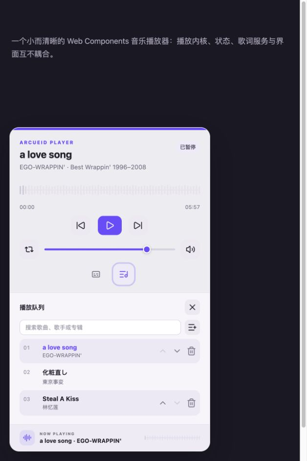
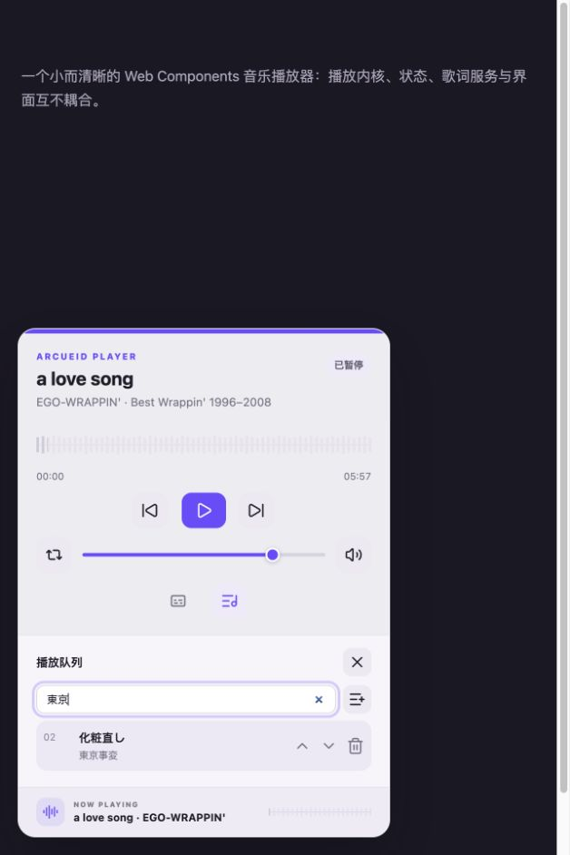
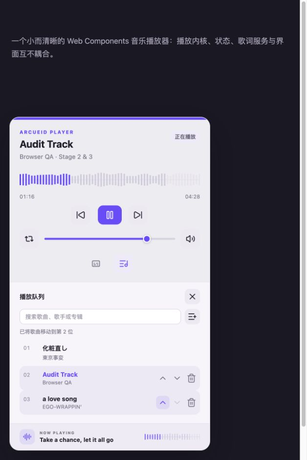
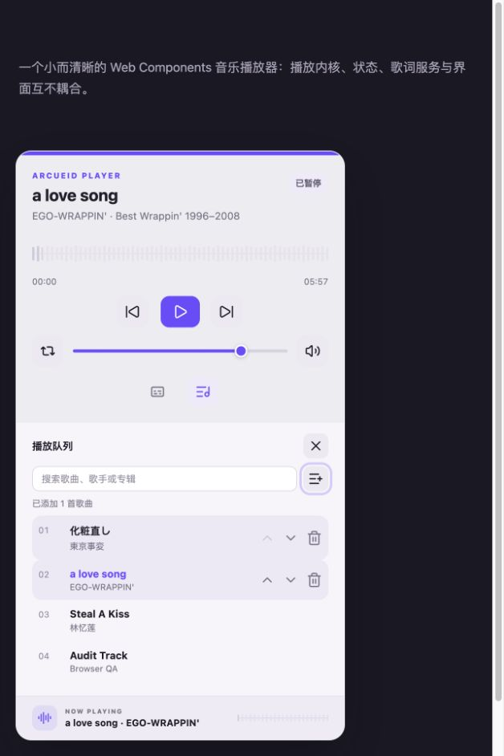
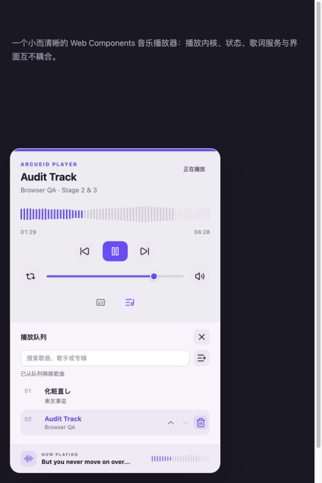
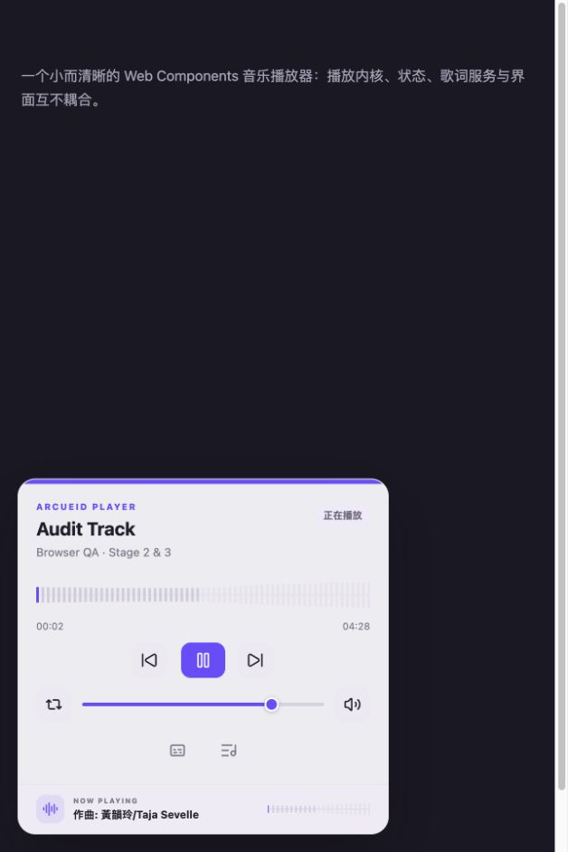

# 阶段 2/3 浏览器审核

审核日期：2026-08-26  
审核范围：系统媒体/后台恢复的可见降级，以及播放队列的搜索、排序、删除、文件导入、当前歌曲定位和播放闭环。  
审核环境：Codex 应用内浏览器，628 × 942 视口，本地 Vite 开发服务器。

## 总体结论

阶段 2/3 的浏览器主流程健康，未发现阻塞发布的问题。队列操作完成后都有可见且可被读屏识别的状态反馈；当前歌曲在排序和删除后仍保持正确关联；用户导入的 JSON 歌单可以追加并立即播放。浏览器控制台只有 Vite 连接日志，没有运行时错误。

## 审核步骤

### 1. 初始播放器——健康

- 紧凑状态下标题、波形进度、播放控制、音量和两个面板入口层级清楚。
- 所有图标按钮都有中文可访问名称，播放进度和音量使用 slider 语义。

### 2. 打开播放队列——健康

- 队列入口具有按下状态；搜索和 JSON 导入位于标题下方，入口明确。
- 当前歌曲使用强调色和 `aria-current`，每首歌都有选择、上移、下移和删除操作。

### 3. 搜索歌曲——健康

- 输入“東京”后只保留对应歌曲，匹配歌曲仍保留完整操作。
- 搜索框有明确标签，系统清除按钮可用；无结果时界面提供空状态文案。

### 4. 调整顺序并保持当前歌曲——健康

- 使用上移/下移后列表编号立即更新，当前播放歌曲仍与原歌曲对象关联。
- “已将歌曲移动到第 2 位”通过 `role=status` 公布；键盘用户不依赖拖拽也能排序。

### 5. 用户文件追加——健康

- 文件选择器接受 JSON，导入后新歌曲追加到队尾，没有中断当前播放项。
- “已添加 1 首歌曲”提供明确结果反馈；导入失败也会在相同区域显示原因。

### 6. 删除歌曲——健康，建议补撤销

- 删除非当前歌曲后编号收拢，当前歌曲和播放状态不变。
- 删除是立即生效操作，目前没有撤销入口；它不会删除源文件，但误触后需要重新添加歌曲。

### 7. 播放导入歌曲——健康

- 导入歌曲可以直接选择并播放，标题、时长、波形、播放按钮和歌词底栏同步更新。
- 播放面板收起后回到紧凑状态，没有残留导入或队列操作状态遮挡主控制区。

## 优点

- 搜索、导入和队列编辑集中在队列面板，不增加主播放器的常驻复杂度。
- 图标操作具有稳定中文名称、禁用状态和键盘焦点语义。
- 排序算法保持当前歌曲身份，而不是错误地按旧索引切换歌曲。
- 操作结果使用状态区域反馈，不只依赖颜色或动画。

## 风险与改进机会

1. 建议为删除增加 5–10 秒撤销入口，降低误触恢复成本。
2. 拖拽排序没有可见拖拽手柄或说明；当前的上移/下移按钮保证了键盘替代路径，因此属于可发现性改进而不是访问阻塞。
3. 28–32 px 的队列辅助按钮满足 WCAG 2.2 的 24 px 最小目标要求，但在触屏设备上仍可扩大到接近 40–44 px。
4. 长歌单尚未在本次截图流中做数百项性能验证；当前列表使用普通 DOM，后续若面向超大歌单可再考虑虚拟列表。

## 证据限制

- 应用内浏览器不能触发操作系统锁屏界面、硬件媒体键或真实的 iOS Safari 后台冻结，因此 Media Session、BFCache 和后台音频恢复的系统级表现不能由这些截图证明。
- 后台生命周期与 Media Session 动作映射已有单元测试覆盖；仍需在 macOS Safari 和 iOS Safari 真机上做最终兼容回归。
- 截图可以确认可见层级、标签和状态，但不能单独证明完整 WCAG 合规；VoiceOver、缩放和触控目标仍需真实设备检查。
